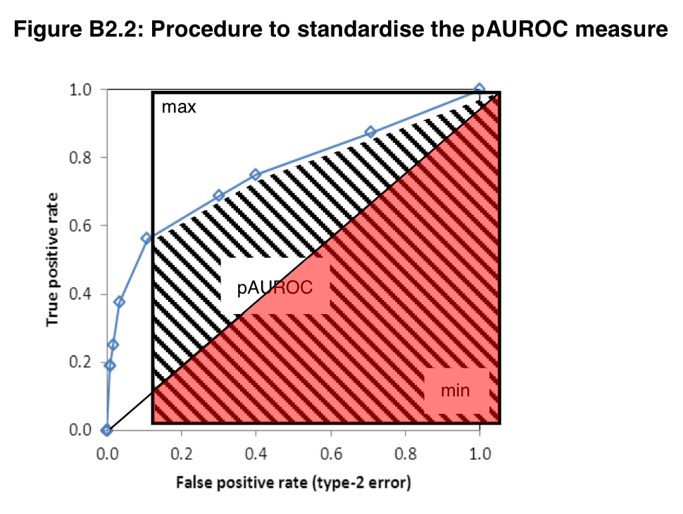

# EMPIRICAL MODEL

## Credit gaps decompositions

\begin{align}
	100*\frac{Credit}{GDP} &= y_t = \tau_{yt} + c_{yt}
\end{align}

We created 90 candidate one-sided credit gap measurements based on the literature. Once a country has more than 15 years of credit measurement available, we start storing its one-sided credit gap values onward. Our decomposition methods include one sided Hodrick-Prescott filter, Hamilton filter (panel and non-panel setting), Moving Average, Structural Time-series model, linear, quadratic and polynomial decompositions, all are decomposed with full sample, rolling 15 years and 20 years rolling window settings. 


## Early Warning Indicator - Logistic regression:

\begin{align}
  pre.crisis_{ti} \sim credit.gap_{tij}
\end{align}

- $i$ is country indicator. $j$ is credit gap filter type

- where $pre.crisis_{it}=$  1 or 0 

- The pre-crisis indicator is set to 1 when t is between 5-12 quarters before a systemic crisis. 
	
- We discard measurements between 1-4 quarters before a crisis, periods during a crisis and post-crisis periods identified in Lo Duca et al. (2017) and Laeven and Valencia (2018). 
  + The indicator is set to 0 at other periods.
  + pre-crisis periods of imported crises identified in the dataset are also set to 0. However, we still discard measurements of periods during and post-crisis for imported  crises.

## AUROC 
Each logistic regression with a different gap measurement yields a Area Under Curve (AUC) of receiver operating characteristic value. There is an underlying assumption that the higher the AUC value is the better overall performance of a credit gap is as an EWI. 

- However, the AUC value received some criticism regarding the area on its lower left corner, where the predictive power of the threshold (TPR) is low.

\begin{align*}
AUC = \int_0^1 TPR d(FPR)
\end{align*}

A ROC curve in the EWI setting represents True Positive Rate (TPR) and False Positive Rate (FPR) of different credit gap thresholds indicating a pre-crisis period. The thresholds are determined by the logistic regression predicted probability values.

## partial standardised AUROC (psAUROC)
To overcome the issue of unnecessary information included in the full AUC. An approach to estimate partial AUC was proposed.

Detken (2014) on partial standardized AUC:

>"Instead of considering only the full AUROC (e.g. Drehmann and Juselius, 2014), this paper also presents a partial standardised AUROC (psAUROC) that cuts off the area associated with a preference parameter of $\theta<0.5$."... 

>"While the psAUROC has been used extensively in the area of medical statistics to assess the performance of a classifier only in specific regions of the ROC curve (e.g. McClish, 1989 and Jiang et al., 1996), it is a new approach in the literature evaluating EWMs"...

>"The results reported in this paper show that the psAUROC can reveal useful additional information as long as the partial area does not become too restricted."

## pAUROC (or pAUC)

Beltran (2021) constrainted the policy loss function to TPR $\ge 2/3$ or Type II error rate $< 1/3$. They then estimated the policy loss function value at different points on the ROC curve by assigning different policy preferences $\alpha$.

$\Rightarrow$ In this paper, we propose to restrict the consideration of the ROC curve to TPR $\ge 2/3$, then estimate the psAUC of the restricted ROC curve region instead. *Our notation of Type I and Type II error follows Beltran (2021) which deviated from previous literature.

\begin{align}
pAUROC = \int_{\frac{2}{3}}^1 TNR \, d(TPR) = \int_{\frac{2}{3}}^1 specificity \, d(sensitivity)
\end{align}

- TNR = 1- FPR
- FPR = Type I error rate, FNR = Type II error rate

## standardize psAUROC - Detken (2014)

```{r psAUC, echo=FALSE, out.width='70%', fig.align="center"}

```

\begin{align}
psAUROC = \frac{1}{2}\left[ 1+ \frac{pAUROC - min}{max - min}\right]
\end{align}

# Model selection and averaging
## Variable selection
### Comparing performance of individual credit gaps
Using partial area under the curve (psAUC) values

### Test for gaps combination performance
Using Markov Chain Monte Carlo Model Comparison ($MC^3$) developed by Madigan and York (1995). The method assigns posterior probability for different credit gaps being selected in most likely models/combinations. Babecky (2014) used this $MC^3$ method to identify potential variables in EWI models.

\begin{align*}
Model_k :  pre.crisis_{ti} \sim \sum\nolimits_j \beta_j * credit.gap_{tij}
\end{align*}

### Variable selection
We selected 29 credit gap measurements based on these 2 criteria.


## Variable selection (top 23 gaps ranked by psAUC)

```{r varselect, echo=FALSE, warning=FALSE, message=FALSE}
options(kableExtra.latex.load_packages = FALSE)
options(knitr.table.format = "pandoc")
library('kableExtra')
library(dplyr)
library(knitr)
#library(rstudioapi)
#setwd(dirname(getActiveDocumentContext()$path))
#getwd()

filepath='../Data/Output/Modelselection_512.csv'
df<-read.csv(filepath, sep = ",", header=TRUE)

#rownames(df) <- df[,1]
name1<- df[,1]
name1<- gsub("_", ".", name1)
name1[which(name1=="c.hp400k")]<-"BIS Basel gap"
df[,1]<-name1

#df<-df[,-1]
df<-df[-c(27:nrow(df)),-c(10:ncol(df))]
#df<-df[-2,]

#colnames(df) <- c("Median", "10pct", "90pct", "Median", "10pct", "90pct", "Median", "10pct", "90pct")

#options(knitr.kable.NA = '')

#df = df %>% mutate_if(is.numeric, format, digits=4)

#kbl(data.frame(x=rnorm(10), y=rnorm(10), x= rnorm(10)), digits = c(1, 4, 4))

kbl(df, "latex", booktabs = T, digits = c(4, 4, 4, 4, 4, 4, 4, 4), escape=FALSE, linesep=c("","", "", "", "\\addlinespace")
      , row.names = FALSE) %>%
  kable_paper("striped") %>%
  #add_header_above(c("Parameters" = 1, "VAR2" = 3, "VAR2 1-cross lag" = 3, "VAR2 2-cross lags" = 3)) %>%
  #footnote(general="UK Bayesian regression results") %>%
  kable_styling(latex_options=c("scale_down","HOLD_position")) %>%
  column_spec(5, bold = TRUE) #%>% #c(0,0,1,0,0,0,1,0,0,0,0,0,0,0,0))
  #gsub(".(begin|end){table.*}", "", ., perl = TRUE)%>%
  #gsub(".centering", "", ., perl = TRUE)
```


## Variable Selection (MC3)
\tiny
```{r varselectMC3, echo=FALSE, warning=FALSE, message=FALSE}
options(kableExtra.latex.load_packages = FALSE)
options(knitr.table.format = "pandoc")
library('kableExtra')
library(dplyr)
library(knitr)
#library(rstudioapi)
#setwd(dirname(getActiveDocumentContext()$path))
#getwd()

filepath='../Data/Output/MC3.csv'
df<-read.csv(filepath, sep = ",", header=TRUE)

#rownames(df) <- df[,1]
name1<- df[,2]
name1<- gsub("_", ".", name1)
name1[which(name1=="c.hp400k")]<-"BIS Basel gap"
df[,2]<-name1
colnames(df)<-c("Variable","Pr(B!=0)","Variable","Pr(B!=0)")

#df<-df[,-1]
df<-df[-c(27:nrow(df)),]
#df<-df[-2,]

#colnames(df) <- c("Median", "10pct", "90pct", "Median", "10pct", "90pct", "Median", "10pct", "90pct")

options(knitr.kable.NA = '')

#df = df %>% mutate_if(is.numeric, format, digits=4)

#kbl(data.frame(x=rnorm(10), y=rnorm(10), x= rnorm(10)), digits = c(1, 4, 4))

kbl(df, "latex", booktabs = T, digits = c(4, 4,4,4), escape=TRUE, linesep=c("","", "", "", "\\addlinespace")
      , row.names = FALSE) %>%
  #kable_paper("striped") %>%
  #add_header_above(c("Parameters" = 1, "VAR2" = 3, "VAR2 1-cross lag" = 3, "VAR2 2-cross lags" = 3)) %>%
  #footnote(general="UK Bayesian regression results") %>%
  kable_styling(latex_options=c("HOLD_position")) #%>%
  #column_spec(5, bold = TRUE) %>% #c(0,0,1,0,0,0,1,0,0,0,0,0,0,0,0))
  #gsub(".(begin|end){table.*}", "", ., perl = TRUE)%>%
  #gsub(".centering", "", ., perl = TRUE)
```
\normalsize

# Model Averaging

# Model averaging

## Bayesian Model Averging
The Bayesian Model Average method is formalized in Raftery (1995) to account for model uncertainty.

### Model posterior probability
equation (33): Model k posterior probability (weight):
\begin{align}
  P(M_k|D) = \frac{P(D|M_k)P(M_k)}{\sum\nolimits_{l=1}^K P(D|M_l)P(M_l)} 
  \approx \frac{exp(-\frac{1}{2}BIC_k)}{\sum\nolimits_{l=1}^K exp(-\frac{1}{2}BIC_l)}
\end{align}

- Where $P(M_k)$ is model prior probability and can be ignored if all models are assumed equal prior weights. 

- $P(D|M_k)$ is marginal likehood. And $P(D|M_k) \propto exp(-\frac{1}{2}BIC_k)$

- In which $BIC_k = 2log (Bayesfactor_{sk}) = \chi^2_{sk} - df_klog(n)$. s indicates the saturated model.

## Model posterior probability
- $BIC_k = 2log (Bayesfactor_{sk}) = \chi^2_{sk} - df_klog(n)$
- $\chi^2_{sk}$ is the deviance of model K from the the saturated model
  + $\chi^2_{sk} = 2(ll(Ms) - ll(Mk))$
  + $ll(Mk)$ is the log-likelihood of model Mk given data D

###  Alternate deviance measurement
We propose using psAUC instead of log-likelihood in the measurement of deviance. Hence, an alternative BIC value can be estimated at:

\begin{align}
BIC_{alt,k} &= 2log (Bayesfactor_{alt,sk}) \\
&= 2(1000*(psAUC_s-psAUC_k)) - df_klog(n)
\end{align}
- We scaled the psAUC value by 1000 since $0<psAUC<1$. Also, by design, $psAUC_s=1$.

## Posterior distribution of coefficients of interest:

$\beta_j$ is the coefficient of credit gap j ($c_j$) in a logistic regression model k against pre-crisis indicator. When considering a particular $\beta_1$ :

\begin{align*}
p(\beta_1|D, \beta_1\ne 0) = \sum\nolimits_{A_1} p(\beta_1|D,M_k)p'(M_k|D)
\end{align*}


- where $p'(M_k|D)=p(M_k|D)/ pr[\beta_1 \ne 0|D]$
- and $pr[\beta_1 \ne 0|D] = \sum\limits_{A_1} p(M_k|D)$
  + this is the probability that $\beta_1$ is in the averaged model
  + $A_1= \{M_k: k=1,...,K; \beta_1 \ne 0\}$, is the set of models that includes $\beta_1$

## Approximation of Bayesian point estimate:

\begin{align}
\hat{\beta}_1 = E[\beta_1|D, \beta_1\ne 0] = \sum\limits_{A_1} \hat{\beta}_1(k)p'(M_k|D)
\end{align}

$SD^2[\beta_1|D, \beta_1\ne 0] =[\sum\limits_{A_1}[se_1^2(k)+]+\hat{\beta_1}(k)]p'(M_k|D)
- E[\beta_1|D, \beta_1\ne 0]^2$

- Where $\hat{\beta}_1(k)$ and $se_1^2(k)$ are respectively the MLE and standard error of $\beta_1$ under the model $M_k$. (Leamer 1978, p.118; Raftery 1993a)


# Weighted credit gap creation
## Weighted averaged credit gap - motivation
GLM binomial estimation: 
\begin{align*}
\widehat{pre.crisis}_{ti} = \widehat{probability}_{ti} = \frac {1}{1+exp(-(a+\sum\nolimits_j \hat{\beta}_j c_{tij}))}
\end{align*}

- With $\hat{\beta}_j$ = $E[\beta_j|D, \beta_j\ne 0] = \sum\limits_{A_j} \hat{\beta}_j(k)p'(M_k|D)$


$\Rightarrow$ We propose a single weighted credit gap $\hat{c}_{ti}$ that satisfies:
\begin{align*}
\frac {1}{1+exp(-(a+\hat{\beta} \hat{c}_{ti}))}= \frac {1}{1+exp(-(a+\sum\nolimits_j \hat{\beta}_j c_{tij}))} \\
\end{align*}
OR
\begin{align}
\sum\limits_j \hat{\beta}_j c_{tij} = \hat{\beta} \hat{c}_{ti}
\end{align}

## Weighted averaged credit gap - creation
\begin{align*}
\sum\limits_j \hat{\beta}_j c_{tij} = \hat{\beta} \hat{c}_{ti}
\end{align*}

We then propose $\hat{\beta} = \sum\nolimits_j \hat{\beta}_j$

Therefore, 

\begin{align}
\hat{c}_{ti} = \frac{\sum\nolimits_j (\hat{\beta}_j c_{tij})}{\sum\nolimits_j\hat{\beta}_j} = \sum\nolimits_j w_j c_{tij}
\end{align}

The weight of each candidate credit gap j is $w_j = \frac{\hat{\beta}_j}{\sum\nolimits_j\hat{\beta}_j}$

## One-sided crisis weighted averaged credit gap

- The weight of each candidate credit gap j is $w_j = \frac{\hat{\beta}_j}{\sum\nolimits_j\hat{\beta}_j}$

- We save the weights $w_j$ at every incremental period $t$ of available data to create a one-sided weight vector $w_{tj}$. 

$\Rightarrow$ To create one-sided crisis weighted averaged credit gap for each country $i$ ($\hat{c}_{ti}$), we compute:
\begin{align}
\hat{c}_{ti,one-sided} = \sum\nolimits_{j} w_{tj} * c_{tij}
\end{align}

## Weights stacked graph
Weights are restricted to be positive to ensure stability
```{r weight, echo=FALSE, out.width='100%', fig.align="center"}
knitr::include_graphics('../Data/Output/Graphs/Weights_stack.pdf')
```

## Weights series graph
```{r weight_series, echo=FALSE, out.width='100%', fig.align="center"}
knitr::include_graphics('../Data/Output/Graphs/Weights_series.pdf')
```
