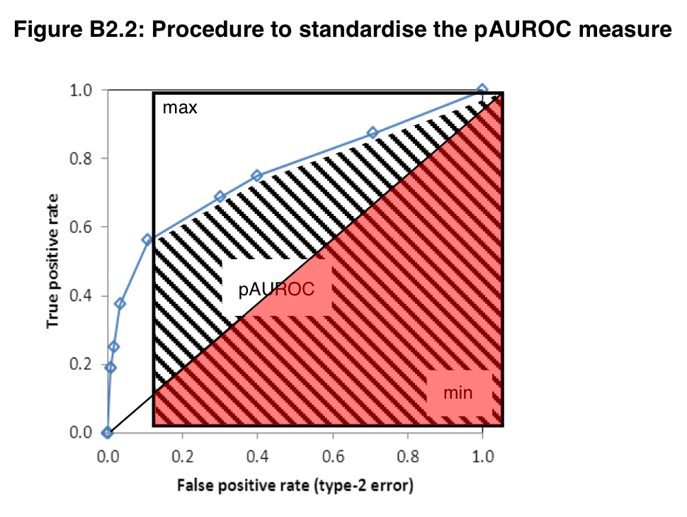

# Introduction
### Introduction
- Motivation
- Contribution
- Literature Review


### Methodology
- Data
- Empirical Model
  + Model Selection
  + Model Averaging
  + Weighted gap creation

### Results

## Motivation
- To overcome model uncertainty in using credit gap as an early warning indicator (EWI) of systemic financial crises, we propose using model averaging of different credit gap measurements. The method is based on Bayesian Model Average - Raftery (1995)


## Motivation
- Area under the curve of operating characteristic (AUROC or AUC) has been widely used as a criterion to determine the performance of a EWI. But it has received some criticism regarding the lower left area of the curve representing low predictive ability of the indicator.
- Borio and Drehmann (2009) and Beltran et al (2021) proposed a policy loss function constraining the relevance of the curve measurement to to just a portion where Type II error rate is less than 1/3 or at least 2/3 of the crises are predicted.    
- Detken (2014) proposed using partial standardized area under the curve (psAUC) as an alternative measurement of the performance of an EWI.

## Contribution
- Compare different credit gap measurements' performance as EWIs using a new criterion - partial standarized AUC (psAUC) contraining Type II error < 1/3.
- Overcome model uncertainty by implementing model averaging. We incoporated psAUC values in the model selection and weighting process, instead of AUC or BIC values.
- For ease of policy implication, we propose a single credit gap measurement from weighted averaging other popularly studied credit gap measurements.


## Literature Review
Beltran (2021) - measured and the performance of BIS Basel credit gap, Structural Time Series model (STM) gap, Moving average (MA) gap, Hamilton filter gap, and optimized the smoothing parameters $\rho$ in those filters to minimize policy loss function. 

\begin{align*}
L_{\theta,\rho}=\alpha TypeI(\theta)+(1-\alpha)TypeII(\theta)|TPR\ge2/3
\end{align*}

- $\theta$ is the optimized threshold that minizes loss function.

Galán (2019) proposed rolling sample of 15 and 20 years when creating one sided cycle.

Drehmann (2021) created Hamilton filter in a panel setting with fixed coefficients on independent variable across countries.

## Data
Sample data periods: 

- 1970-Q4 - 2017-Q4 across 43 countries. 
We omit periods for countries with shorter credit measurement.

Systemic crisis data:

- European Systemic Risk Board crisis data set (Lo Duca et al. 2017)
- Laeven and Valencia (2018)

Credit/GDP ratio data:

- Bank of International Settlement (BIS)
  + Latest Credit data is available at 2021:Q3

# Model
## Credit gaps creation

\begin{align}
	100*\frac{Credit}{GDP} &= y_t = \tau_{yt} + c_{yt}
\end{align}

- We created 90 candidate one-sided credit gap measurements based on the literature.
  + Once a country has more than 15 years of credit measurement available, we start storing its one-sided credit gap values onward.
  
## Early Warning Indicator - Logistic regression:

\begin{align}
  pre.crisis_{ti} \sim credit.gap_{tij}
\end{align}

- $i$ is country indicator. $j$ is credit gap filter type

- where $pre.crisis_{it}=$  1 or 0 

- The pre-crisis indicator is set to 1 when t is between 5-12 quarters before a systemic crisis. 
	
- We discard measurements between 1-4 quarters before a crisis, periods during a crisis and post-crisis periods identified in Lo Duca et al. (2017) and Laeven and Valencia (2018). 
  + The indicator is set to 0 at other periods.
  + pre-crisis periods of imported crises identified in the dataset are also set to 0. However, we still discard measurements of periods during and post-crisis for imported  crises.

## AUROC 
Each logistic regression with a different gap measurement yields a Area Under Curve (AUC) of receiver operating characteristic value. There is an underlying assumption that the higher the AUC value is the better overall performance of a credit gap is as an EWI. 

- However, the AUC value received some criticism regarding the area on its lower left corner, where the predictive power of the threshold (TPR) is low.

\begin{align*}
AUC = \int_0^1 TPR d(FPR)
\end{align*}

A ROC curve in the EWI setting represents True Positive Rate (TPR) and False Positive Rate (FPR) of different credit gap thresholds indicating a pre-crisis period. The thresholds are determined by the logistic regression predicted probability values.

## partial standardised AUROC (psAUROC)
To overcome the issue of unnecessary information included in the full AUC. An approach to estimate partial AUC was proposed.

Detken (2014) on partial standardized AUC:

>"Instead of considering only the full AUROC (e.g. Drehmann and Juselius, 2014), this paper also presents a partial standardised AUROC (psAUROC) that cuts off the area associated with a preference parameter of $\theta<0.5$."... 

>"While the psAUROC has been used extensively in the area of medical statistics to assess the performance of a classifier only in specific regions of the ROC curve (e.g. McClish, 1989 and Jiang et al., 1996), it is a new approach in the literature evaluating EWMs"...

>"The results reported in this paper show that the psAUROC can reveal useful additional information as long as the partial area does not become too restricted."

## pAUROC (or pAUC)

Beltran (2021) constrainted the policy loss function to TPR $\ge 2/3$ or Type II error rate $< 1/3$. They then estimated the policy loss function value at different points on the ROC curve by assigning different policy preferences $\alpha$.

$\Rightarrow$ In this paper, we propose to restrict the consideration of the ROC curve to TPR $\ge 2/3$, then estimate the psAUC of the restricted ROC curve region instead. *Our notation of Type I and Type II error follows Beltran (2021) which deviated from previous literature.

\begin{align}
pAUROC = \int_{\frac{2}{3}}^1 TNR \, d(TPR) = \int_{\frac{2}{3}}^1 specificity \, d(sensitivity)
\end{align}

- TNR = 1- FPR
- FPR = Type I error rate, FNR = Type II error rate

## standardize psAUROC - Detken (2014)

```{r psAUC, echo=FALSE, out.width='70%', fig.align="center"}

```

\begin{align}
psAUROC = \frac{1}{2}\left[ 1+ \frac{pAUROC - min}{max - min}\right]
\end{align}


## Variable selection
### Comparing performance of individual credit gaps
Using partial area under the curve (psAUC) values

### Test for gaps combination performance
Using Markov Chain Monte Carlo Model Comparison ($MC^3$) developed by Madigan and York (1995). The method assigns posterior probability for different credit gaps being selected in most likely models/combinations. Babecky (2014) used this $MC^3$ method to identify potential variables in EWI models.

\begin{align*}
Model_k :  pre.crisis_{ti} \sim \sum\nolimits_j \beta_j * credit.gap_{tij}
\end{align*}

### Variable selection
We selected 29 credit gap measurements based on these 2 criteria.


## Variable selection (top 24 gaps ranked by psAUC)

\resizebox{\linewidth}{!}{
\begin{tabular}[t]{lrrr>{}rrrrr}
\toprule
Cycle & BIC & AIC & AUC & psAUC & c.Threshold & Type.I & Type.II & Policy.Loss.Function\\
\midrule
null & 0.0000 & 0.0000 & 0.5000 & \textbf{0.5000} & NA & 1.0000 & 0.0000 & 0.5000\\
c.bn620 & -108.0679 & -114.4506 & 0.7048 & \textbf{0.6379} & 0.6581 & 0.3962 & 0.3019 & 0.2481\\
c.hamilton28.panel & -149.8518 & -156.2346 & 0.7107 & \textbf{0.6359} & 9.7674 & 0.3912 & 0.3066 & 0.2470\\
c.hamilton13.panelr20 & -149.3378 & -155.7205 & 0.7030 & \textbf{0.6328} & 5.9924 & 0.4287 & 0.2547 & 0.2487\\
c.hamilton24.panel & -134.4093 & -140.7920 & 0.6991 & \textbf{0.6322} & 7.1794 & 0.4383 & 0.2689 & 0.2644\\
\addlinespace
c.hamilton13.panelr15 & -125.3568 & -131.7396 & 0.6923 & \textbf{0.6314} & 6.6651 & 0.4256 & 0.2925 & 0.2666\\
c.ma1 & -120.8108 & -127.1936 & 0.6922 & \textbf{0.6313} & 5.7812 & 0.3989 & 0.3160 & 0.2590\\
c.hamilton20.panelr15 & -134.3190 & -140.7017 & 0.6981 & \textbf{0.6311} & 7.5583 & 0.4612 & 0.2689 & 0.2850\\
c.hamilton20.panelr20 & -151.3035 & -157.6862 & 0.7045 & \textbf{0.6311} & 8.0087 & 0.4323 & 0.3066 & 0.2809\\
c.hamilton28.panelr20 & -164.6098 & -170.9925 & 0.7157 & \textbf{0.6300} & 10.8705 & 0.3946 & 0.2925 & 0.2412\\
\addlinespace
c.hamilton24.panelr20 & -155.8958 & -162.2786 & 0.7094 & \textbf{0.6299} & 9.2099 & 0.4253 & 0.2830 & 0.2610\\
c.hamilton24.panelr15 & -142.3051 & -148.6879 & 0.7027 & \textbf{0.6295} & 10.5773 & 0.3958 & 0.3160 & 0.2565\\
c.hamilton20.panel & -126.8625 & -133.2452 & 0.6907 & \textbf{0.6288} & 5.6212 & 0.4686 & 0.2830 & 0.2997\\
c.hamilton28.panelr15 & -153.5231 & -159.9058 & 0.7085 & \textbf{0.6267} & 11.5786 & 0.3871 & 0.3019 & 0.2410\\
c.hamilton13.panel & -133.9347 & -140.3175 & 0.6922 & \textbf{0.6250} & 4.9769 & 0.4285 & 0.2877 & 0.2664\\
\addlinespace
c.bn220 & -109.3128 & -115.6955 & 0.6963 & \textbf{0.6218} & 0.2776 & 0.4080 & 0.3255 & 0.2724\\
c.linear2 & -135.4069 & -141.7896 & 0.6879 & \textbf{0.6204} & 3.9989 & 0.4616 & 0.2925 & 0.2986\\
c.bn2 & -135.9914 & -142.3741 & 0.6842 & \textbf{0.6165} & 0.1864 & 0.4530 & 0.3113 & 0.3021\\
c.bn6 & -132.7915 & -139.1742 & 0.6835 & \textbf{0.6113} & 0.4710 & 0.4371 & 0.2830 & 0.2712\\
c.bn615 & -54.9953 & -61.3781 & 0.6756 & \textbf{0.6070} & 0.5680 & 0.4179 & 0.3255 & 0.2806\\
\addlinespace
c.bn215 & -83.9469 & -90.3297 & 0.6749 & \textbf{0.6047} & 0.1349 & 0.4761 & 0.3302 & 0.3357\\
c.poly420 & 3.5738 & -2.8090 & 0.5772 & \textbf{0.6011} & 0.1651 & 0.4980 & 0.3302 & 0.3570\\
BIS Basel gap & -121.5910 & -127.9738 & 0.6733 & \textbf{0.5960} & 3.0578 & 0.4441 & 0.3255 & 0.3032\\
c.bn4 & -169.1186 & -175.5014 & 0.6892 & \textbf{0.5943} & 1.2840 & 0.3837 & 0.3255 & 0.2532\\
c.bn415 & -89.6147 & -95.9975 & 0.6669 & \textbf{0.5929} & 0.4435 & 0.4792 & 0.2925 & 0.3152\\
\bottomrule
\end{tabular}}

# Model averaging

## Bayesian Model Averging
The Bayesian Model Average method is formalized in Raftery (1995) to account for model uncertainty.

### Model posterior probability
equation (33): Model k posterior probability (weight):
\begin{align}
  P(M_k|D) = \frac{P(D|M_k)P(M_k)}{\sum\nolimits_{l=1}^K P(D|M_l)P(M_l)} 
  \approx \frac{exp(-\frac{1}{2}BIC_k)}{\sum\nolimits_{l=1}^K exp(-\frac{1}{2}BIC_l)}
\end{align}

- Where $P(M_k)$ is model prior probability and can be ignored if all models are assumed equal prior weights. 

- $P(D|M_k)$ is marginal likehood. And $P(D|M_k) \propto exp(-\frac{1}{2}BIC_k)$

- In which $BIC_k = 2log (Bayesfactor_{sk}) = \chi^2_{sk} - df_klog(n)$. s indicates the saturated model.

## Model posterior probability
- $BIC_k = 2log (Bayesfactor_{sk}) = \chi^2_{sk} - df_klog(n)$
- $\chi^2_{sk}$ is the deviance of model K from the the saturated model
  + $\chi^2_{sk} = 2(ll(Ms) - ll(Mk))$
  + $ll(Mk)$ is the log-likelihood of model Mk given data D

###  Alternate deviance measurement
We propose using psAUC instead of log-likelihood in the measurement of deviance. Hence, an alternative BIC value can be estimated at:

\begin{align}
BIC_{alt,k} &= 2log (Bayesfactor_{alt,sk}) \\
&= 2(1000*(psAUC_s-psAUC_k)) - df_klog(n)
\end{align}
- We scaled the psAUC value by 1000 since $0<psAUC<1$. Also, by design, $psAUC_s=1$.

## Posterior distribution of coefficients of interest:

$\beta_j$ is the coefficient of credit gap j ($c_j$) in a logistic regression model k against pre-crisis indicator. When considering a particular $\beta_1$ :

\begin{align*}
p(\beta_1|D, \beta_1\ne 0) = \sum\nolimits_{A_1} p(\beta_1|D,M_k)p'(M_k|D)
\end{align*}


- where $p'(M_k|D)=p(M_k|D)/ pr[\beta_1 \ne 0|D]$
- and $pr[\beta_1 \ne 0|D] = \sum\limits_{A_1} P(M_k|D)$
  + this is the probability that $\beta_1$ is in the averaged model
  + $A_1= \{M_k: k=1,...,K; \beta_1 \ne 0\}$, is the set of models that includes $\beta_1$

## Approximation of Bayesian point estimate:

\begin{align}
\hat{\beta}_1 = E[\beta_1|D, \beta_1\ne 0] = \sum\limits_{A_1} \hat{\beta}_1(k)p'(M_k|D)
\end{align}

$SD^2[\beta_1|D, \beta_1\ne 0] =[\sum\limits_{A_1}[se_1^2(k)+]+\hat{\beta_1}(k)]p'(M_k|D)
- E[\beta_1|D, \beta_1\ne 0]^2$

- Where $\hat{\beta}_1(k)$ and $se_1^2(k)$ are respectively the MLE and standard error of $\beta_1$ under the model $M_k$. (Leamer 1978, p.118; Raftery 1993a)


# Weighted credit gap creation
## Weighted averaged credit gap - motivation
GLM binomial estimation: 
\begin{align*}
\widehat{pre.crisis}_{ti} = \widehat{probability}_{ti} = \frac {1}{1+exp(-(a+\sum\nolimits_j \hat{\beta}_j c_{tij}))}
\end{align*}

- With $\hat{\beta}_j$ = $E[\beta_j|D, \beta_j\ne 0] = \sum\limits_{A_j} \hat{\beta}_j(k)p'(M_k|D)$


$\Rightarrow$ We propose a single weighted credit gap $\hat{c}_{ti}$ that satisfies:
\begin{align*}
\frac {1}{1+exp(-(a+\hat{\beta} \hat{c}_{ti}))}= \frac {1}{1+exp(-(a+\sum\nolimits_j \hat{\beta}_j c_{tij}))} \\
\end{align*}
OR
\begin{align}
\sum\limits_j \hat{\beta}_j c_{tij} = \hat{\beta} \hat{c}_{ti}
\end{align}

## Weighted averaged credit gap - creation
\begin{align*}
\sum\limits_j \hat{\beta}_j c_{tij} = \hat{\beta} \hat{c}_{ti}
\end{align*}

We then propose $\hat{\beta} = \sum\nolimits_j \hat{\beta}_j$

Therefore, 

\begin{align}
\hat{c}_{ti} = \frac{\sum\nolimits_j (\hat{\beta}_j c_{tij})}{\sum\nolimits_j\hat{\beta}_j} = \sum\nolimits_j w_j c_{tij}
\end{align}

The weight of each candidate credit gap j is $w_j = \frac{\hat{\beta}_j}{\sum\nolimits_j\hat{\beta}_j}$

## One-sided crisis weighted averaged credit gap

- The weight of each candidate credit gap j is $w_j = \frac{\hat{\beta}_j}{\sum\nolimits_j\hat{\beta}_j}$

- We save the weights $w_j$ at every incremental period $t$ of available data to create a one-sided weight vector $w_{tj}$. 

$\Rightarrow$ To create one-sided crisis weighted averaged credit gap for each country $i$ ($\hat{c}_{ti}$), we compute:
\begin{align}
\hat{c}_{ti,one-sided} = \sum\nolimits_{j} w_{tj} * c_{tij}
\end{align}


# Empirical Results
## Comparing performance of weighted gap as an EWI

\resizebox{\linewidth}{!}{
\begin{tabular}[t]{llrrr>{}rrrrr}
\toprule
  & Cycle & BIC & AIC & AUC & psAUC & c.Threshold & Type.I & Type.II & Policy.Loss.Function\\
\midrule
1 & null & 0.0000 & 0.0000 & 0.5000 & \textbf{0.5000} & NA & 1.0000 & 0.0000 & 0.5000\\
\textbf{2} & \textbf{1-sided weighted-gap} & \textbf{-187.2874} & \textbf{-193.6701} & \textbf{0.7407} & \textbf{\textbf{0.6809}} & \textbf{1.5478} & \textbf{0.3724} & \textbf{0.2877} & \textbf{0.2215}\\
3 & c.bn620 & -108.0679 & -114.4506 & 0.7048 & \textbf{0.6379} & 0.6581 & 0.3962 & 0.3019 & 0.2481\\
4 & c.hamilton28.panel & -149.8518 & -156.2346 & 0.7107 & \textbf{0.6359} & 9.7674 & 0.3912 & 0.3066 & 0.2470\\
5 & c.hamilton13.panelr20 & -149.3378 & -155.7205 & 0.7030 & \textbf{0.6328} & 5.9924 & 0.4287 & 0.2547 & 0.2487\\
\addlinespace
6 & c.hamilton24.panel & -134.4093 & -140.7920 & 0.6991 & \textbf{0.6322} & 7.1794 & 0.4383 & 0.2689 & 0.2644\\
7 & c.hamilton13.panelr15 & -125.3568 & -131.7396 & 0.6923 & \textbf{0.6314} & 6.6651 & 0.4256 & 0.2925 & 0.2666\\
8 & c.ma1 & -120.8108 & -127.1936 & 0.6922 & \textbf{0.6313} & 5.7812 & 0.3989 & 0.3160 & 0.2590\\
9 & c.hamilton20.panelr15 & -134.3190 & -140.7017 & 0.6981 & \textbf{0.6311} & 7.5583 & 0.4612 & 0.2689 & 0.2850\\
10 & c.hamilton20.panelr20 & -151.3035 & -157.6862 & 0.7045 & \textbf{0.6311} & 8.0087 & 0.4323 & 0.3066 & 0.2809\\
\addlinespace
11 & c.hamilton28.panelr20 & -164.6098 & -170.9925 & 0.7157 & \textbf{0.6300} & 10.8705 & 0.3946 & 0.2925 & 0.2412\\
12 & c.hamilton24.panelr20 & -155.8958 & -162.2786 & 0.7094 & \textbf{0.6299} & 9.2099 & 0.4253 & 0.2830 & 0.2610\\
18 & c.linear2 & -135.4069 & -141.7896 & 0.6879 & \textbf{0.6204} & 3.9989 & 0.4616 & 0.2925 & 0.2986\\
19 & c.bn2 & -135.9914 & -142.3741 & 0.6842 & \textbf{0.6165} & 0.1864 & 0.4530 & 0.3113 & 0.3021\\
20 & c.bn6 & -132.7915 & -139.1742 & 0.6835 & \textbf{0.6113} & 0.4710 & 0.4371 & 0.2830 & 0.2712\\
\addlinespace
21 & c.bn615 & -54.9953 & -61.3781 & 0.6756 & \textbf{0.6070} & 0.5680 & 0.4179 & 0.3255 & 0.2806\\
22 & c.bn215 & -83.9469 & -90.3297 & 0.6749 & \textbf{0.6047} & 0.1349 & 0.4761 & 0.3302 & 0.3357\\
23 & c.poly420 & 3.5738 & -2.8090 & 0.5772 & \textbf{0.6011} & 0.1651 & 0.4980 & 0.3302 & 0.3570\\
\textbf{24} & \textbf{BIS Basel gap} & \textbf{-121.5910} & \textbf{-127.9738} & \textbf{0.6733} & \textbf{\textbf{0.5960}} & \textbf{3.0578} & \textbf{0.4441} & \textbf{0.3255} & \textbf{0.3032}\\
25 & c.bn4 & -169.1186 & -175.5014 & 0.6892 & \textbf{0.5943} & 1.2840 & 0.3837 & 0.3255 & 0.2532\\
\addlinespace
26 & c.bn415 & -89.6147 & -95.9975 & 0.6669 & \textbf{0.5929} & 0.4435 & 0.4792 & 0.2925 & 0.3152\\
27 & c.bn520 & -99.7674 & -106.1501 & 0.6744 & \textbf{0.5928} & 0.5016 & 0.4234 & 0.3302 & 0.2883\\
28 & c.stm15 & -79.5531 & -85.9358 & 0.6575 & \textbf{0.5924} & 2.0027 & 0.4778 & 0.3160 & 0.3281\\
29 & c.hp125k1 & -92.2897 & -98.6725 & 0.6562 & \textbf{0.5924} & 2.5216 & 0.4547 & 0.3302 & 0.3158\\
30 & c.hp221k1 & -106.8842 & -113.2669 & 0.6656 & \textbf{0.5921} & 2.6641 & 0.4561 & 0.3160 & 0.3079\\
\bottomrule
\end{tabular}}

## Plot weighted gap against BIS gap

```{r wUS, echo=FALSE, out.width='100%', fig.align="center"}
knitr::include_graphics('../Data/Output/Graphs/Weighted_credit_gap_US.pdf')
```

## Plot weighted gap against BIS gap

```{r wUK, echo=FALSE, out.width='100%', fig.align="center"}
knitr::include_graphics('../Data/Output/Graphs/Weighted_credit_gap_UK.pdf')
```

<!-- ## Results Regression Graphs: United Kingdom VAR(2) -->
<!-- ```{r, echo=FALSE} -->
<!-- knitr::include_graphics('../../HPCredit/Regression/VAR_2/Output/Graphs/HP_Credit_4graphs_GB.pdf') -->
<!-- ``` -->

<!-- ## Comparison with other decomposition methods: US -->
<!-- ```{r UKrobust, echo=FALSE, out.width='70%'} -->
<!-- knitr::include_graphics('../../HPCredit/Regression/AR_2/Output/graphs/HP_Credit_2graphs_US.pdf') -->
<!-- ``` -->

<!-- ## Comparison with other decomposition methods: UK -->
<!-- ```{r USrobust, echo=FALSE, out.width='70%'} -->
<!-- knitr::include_graphics('../../HPCredit/Regression/AR_2/Output/graphs/HP_Credit_2graphs_GB.pdf') -->
<!-- ``` -->


<!-- ## Conclusion -->
<!-- Dynamics of temporary components in housing and credit -->

<!-- - Evidence showing that past movement of a cycle has predictive power over the other cycle -->
<!-- - Extracting temporary and permanent components information gave insights on the dynamics of the two series -->
